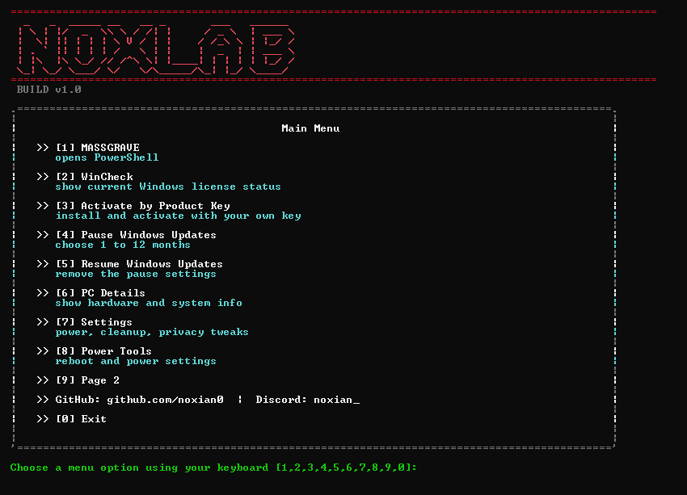
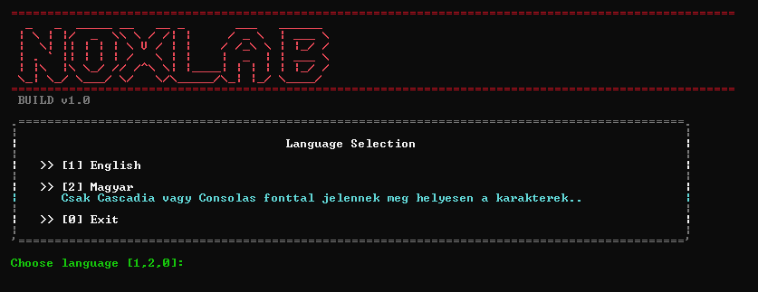
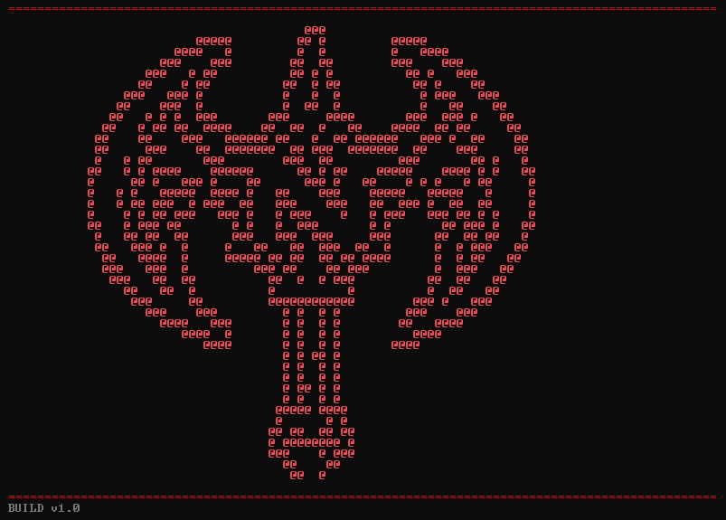
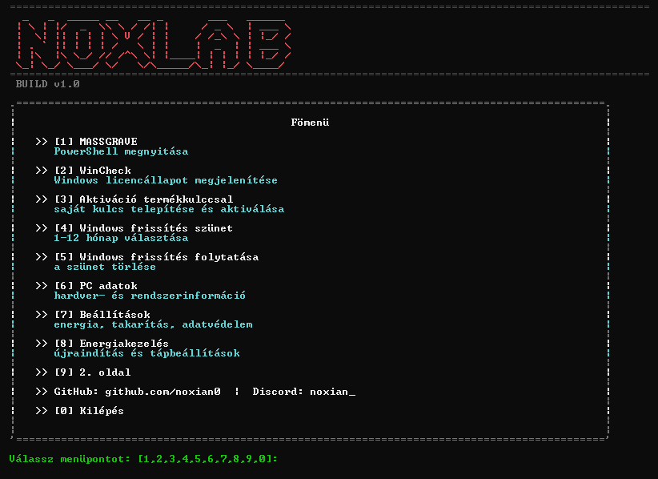

# NoxLab

Windows utility toolkit with debloat, system tools, maintenance shortcuts, and quick-access helpers in a console UI.

## Screenshots

## Features

--[Massgrave](https://github.com/massgravel/Microsoft-Activation-Scripts) import +
other functions:
- Windows upadate pause and activation
- System info page
- Settings and maintenance tools
- Power tools page
- Debloat panel with selectable app removal and reinstall shortcuts
- GPU driver quick-open page
- English and Hungarian menu support

## Launch

Use:

`NoxLab CMD.cmd`

This is the main launcher.

## Files

- `NoxLab.ps1` - main application
- `NoxLab CMD.cmd` - main launcher
- `NoxLab CMD Host.cmd` - host runner used by the launcher

## Notes

- Some actions require administrator privileges.
- Debloat actions work best when NoxLab is started as administrator.
- Hungarian special characters may depend on the console font being used.

## Warning

- Use NoxLab only on devices you personally own or are explicitly authorized to manage.
- Do not use licensing, activation, or system-altering actions on company, school, client, or other managed devices.
- Any third-party tool opened by NoxLab should be used responsibly and only where you have clear permission.

## Status

This project is still being actively adjusted and expanded.

---

# NoxLab - Magyar

Windows segédeszköz-készlet debloat funkciókkal, rendszereszközökkel, karbantartási gyorsgombokkal és konzolos felülettel.

## Képek

## Funkciók

--[Massgrave](https://github.com/massgravel/Microsoft-Activation-Scripts) import +
más funciók:
- Windows frissítés szüneteltetése és Aktiválása
- Rendszerinformációs oldal
- Beállítások és karbantartási eszközök
- Energiakezelési és újraindítási eszközök
- Debloat panel választható alkalmazástörléssel és újratelepítési gyorslinkekkel
- GPU driver gyorsmegnyitó oldal
- Angol és magyar nyelvű menü

## Indítás

Használd ezt:

`NoxLab CMD.cmd`

Ez a fő indítófájl.

## Fájlok

- `NoxLab.ps1` - a fő alkalmazás
- `NoxLab CMD.cmd` - a fő indító
- `NoxLab CMD Host.cmd` - az indító által használt host futtatófájl

## Megjegyzések

- Egyes funkciók rendszergazdai jogosultságot igényelnek.
- A debloat műveletek akkor működnek a legjobban, ha a NoxLab rendszergazdaként indul.
- A magyar speciális karakterek megjelenése függhet a használt konzol betűtípusától.

## Figyelmeztetés

- A NoxLabot csak saját tulajdonú vagy kifejezetten kezelt eszközökön használd.
- Ne használj licencelési, aktiválási vagy rendszermódosító funkciókat céges, iskolai, ügyfélhez tartozó vagy egyéb felügyelt gépeken.
- A NoxLab által megnyitott külső eszközöket és oldalakat csak felelősséggel, megfelelő jogosultság mellett használd.

## Állapot

Ez a projekt jelenleg is aktív fejlesztés alatt áll.
